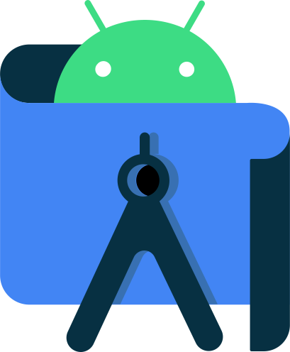
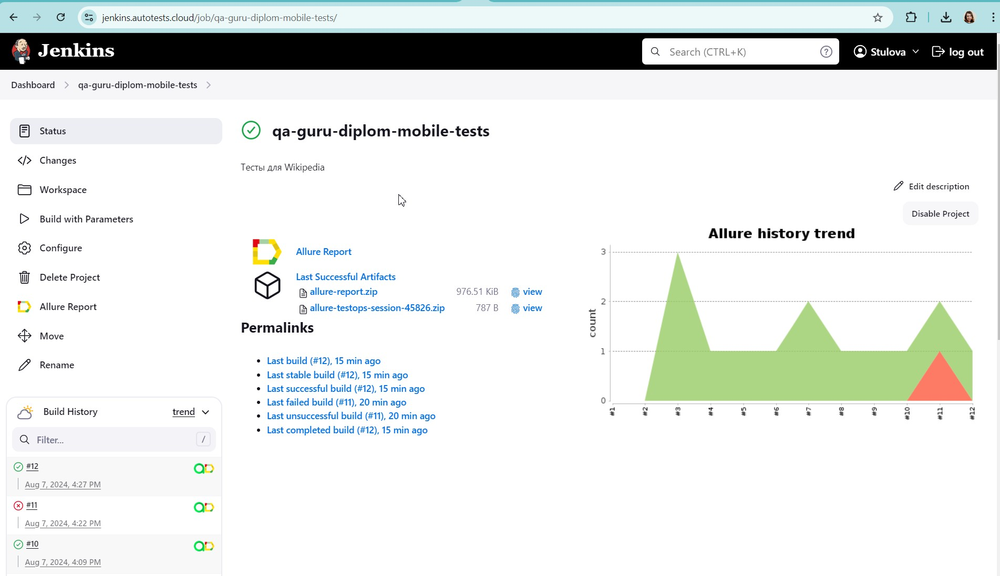
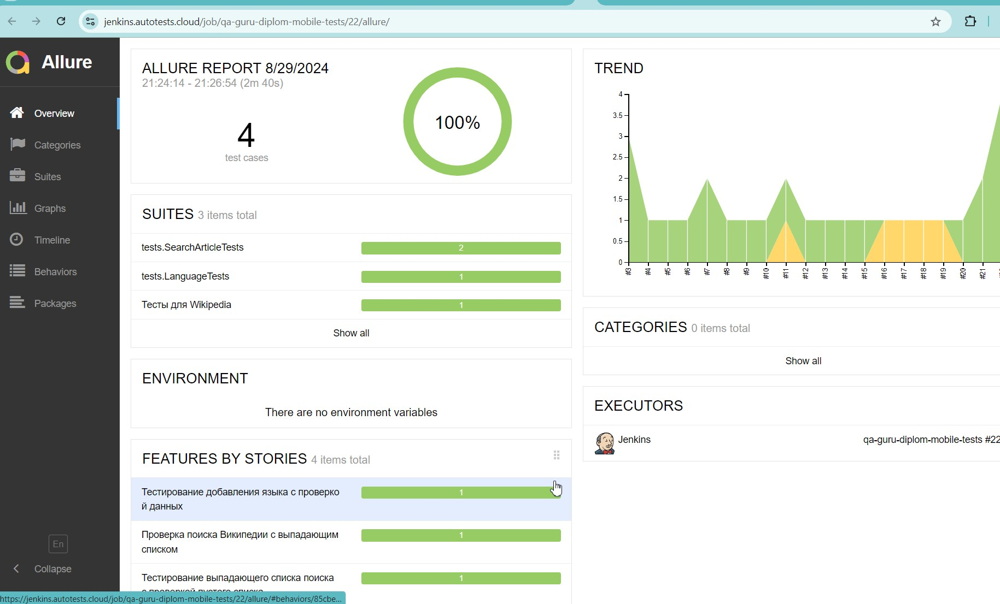
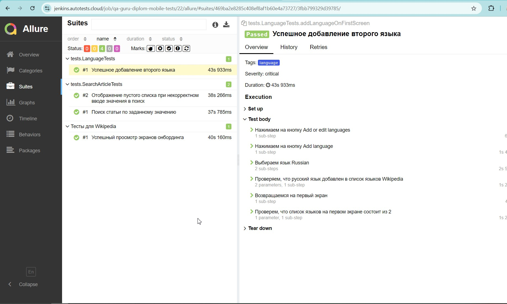
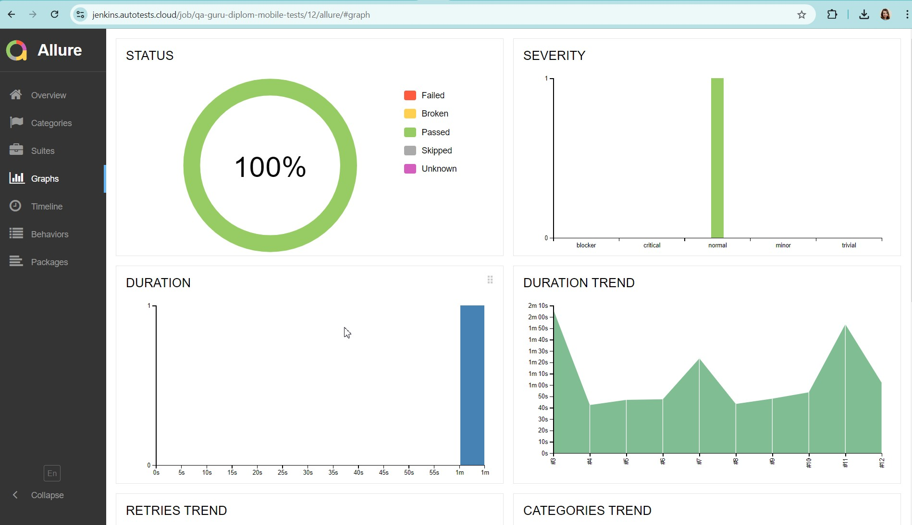
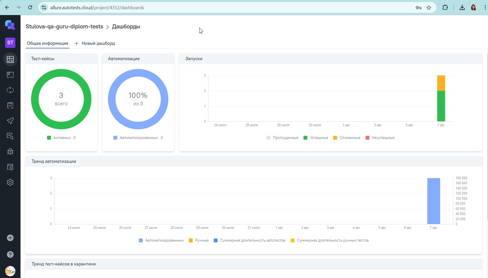
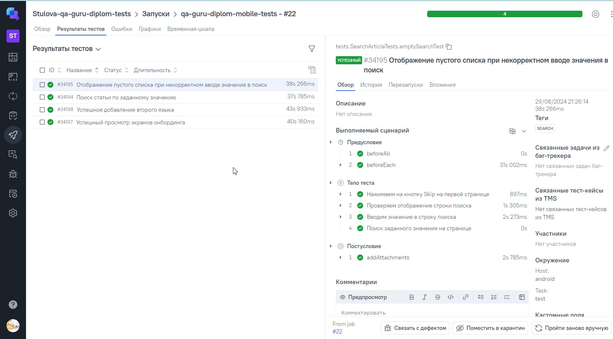
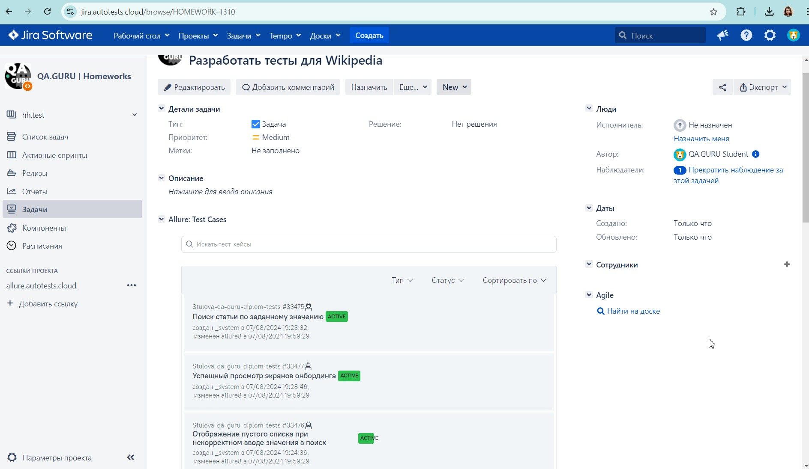
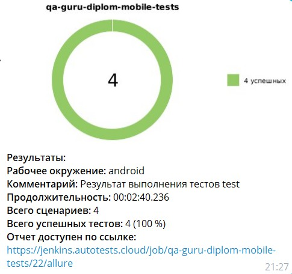

<h2 align="center">Проект по мобильной автоматизации для приложения Wikipedia <a target="_blank" href="https://www.wikipedia.org/"></a> </h2>

<p align="center">

</p>

<a name="наверх"></a>

# :green_book: *Содержание*
+ [Технологии и инструменты](#Technology)
+ [Особенности проекта](#особенности-проекта)
+ [Примеры автоматизированных тест кейсов](#TestCases)
+ [Запуск тестов в Jenkins](#Jenkins)
+ [Команды для запуска из терминала](#SystemProperty)
+ [Отчет о результатах тестирования в Allure Report](#AllureReport)
+ [Интеграция с Allure TestOps](#AllureTestOps)
+ [Интеграция с Jira](#Jira)
+ [Уведомление в Telegram при помощи Alert bot](#Telegram)
+ [Пример видео выполнения теста на Browserstack](#Browserstack)

<h1 align="left">
<a name="Technology"><i>Технологии и инструменты</i></a>
</h1>


<p align="center">  
<a href="https://www.jetbrains.com/idea/"></a>  
<a href="https://www.java.com/"></a>  
<a href="https://github.com/"></a>  
<a href="https://junit.org/junit5/"></a>  
<a href="https://gradle.org/"></a>  
<a href="https://selenide.org/"></a>  
<a href="https://github.com/appium/appium-inspector/raw/main/docs/icon.png"></a>  
<a href="https://github.com/allure-framework/allure2"></a> 
<a href="https://qameta.io/"></a>   
<a href="https://avatars.githubusercontent.com/u/3221291?s=200&v=4"></a>  
<a href="https://cdn.worldvectorlogo.com/logos/android-studio-1.svg"></a>  
<a href="https://www.jenkins.io/"></a>  
<a href="https://www.atlassian.com/ru/software/jira/"></a>  
</p>

## Особенности проекта
- Проект состоит из мобильных тестов на Android
- В данном проекте автотесты написаны на языке `Java`
- В качестве сборщика был использован - `Gradle`
- Использованы фреймворки `JUnit 5` и `Selenide`
- Шаблон проектирования `Page Object`
- Использование техноголии `Owner` для придания тестам гибкости и легкости конфигурации
- Возможность запуска тестов: локально, удалённо, по тегам
- При прогоне тестов браузер запускается в `BrowserStack`
- Возможность запуска проектов с помощью `Jenkins`
- Возможность запуска тестов напрямую из `Allure TestOps`
- Интеграция с `Jira`
- Уведомление о результатах прохождения в `Telegram`
- По итогу прохождения автотестов генерируется `Allure` отчет. Содержание отчета:
    - Шаги теста
    - Скриншот страницы на последнем шаге
    - Исходный код страницы в браузере
    - Логи консоли браузера
    - Видео выполнения автотеста

<h1 align="left">
<a name="TestCases"><i>Примеры автоматизированных тест кейсов</i></a>
</h1>

- :white_check_mark: Проверка экранов онбординга
- :white_check_mark: Проверка функции поиска по тексту
- :white_check_mark: Проверка функции отображения пустого списка результатов поиска при некорректном вводе значения


<h1 align="left">
  <a name="Jenkins"><i>Запуск тестов в Jenkins</i></a>
</h1>

<a target="_blank" href="https://jenkins.autotests.cloud/job/qa-guru-diplom-mobile-tests/">**Сборка в Jenkins**</a>
<p align="center">  
<a href="https://jenkins.autotests.cloud/job/qa-guru-diplom-mobile-tests/"></a>  
</p>

<h1 align="left">
<a name="SystemProperty"><i>Команды для запуска из терминала</i></a>
</h1>


***Локальный запуск:***
> Для работы со своей учетной записью на https://www.browserstack.com/ следует отредактировать файл - authData.properties
> Если требуется изменить устройство следует отредактировать файл - browserstack.properties
> Для работы со своим мобильным устройством - заменить параметры в файле real.properties  
> Для работы с отличным от проектного эмулятором стоит изменить параметры в файле - emulation.properties

```bash  
gradle test -DdeviceHost=emulation
```

***Удаленный запуск (через browserstack):***
```bash  
gradle test -DdeviceHost=browserstack
```


<h1 align="left">
  <a name="AllureReport"><i>Отчет о результатах тестирования в Allure</i></a>
</h1>

<a target="_blank" href="https://jenkins.autotests.cloud/job/qa-guru-diplom-mobile-tests/allure/">**Отчёт в Allure**</a>
<p align="center">  


### *Основная страница отчёта*

<p align="center">  
  
</p>  

### *Тест кейсы*

<p align="center">  
  
</p>

### *Графики*

 <p align="center">  
  
</p>


<h1 align="left">
 <a name="AllureTestOps"><i>Интеграция с Allure TestOps</i></a>
</h1>

<a target="_blank" href="https://allure.autotests.cloud/project/4352/dashboards">**Проект в TestOps**</a>
<p align="center">  


<p align="center">  
  
</p>  

## *Тест кейсы*

<p align="center">  
  
</p>


<h1 align="left">
 <a name="Jira"><i>Интеграция с Jira</i></a>
</h1>

<a target="_blank" href="https://jira.autotests.cloud/browse/HOMEWORK-1310">**Тикет в Jira**</a>
<p align="center">  


<p align="center">  
  
</p>

<h1 align="left">
 <a name="Telegram"><i>Уведомление в Telegram при помощи Alert bot</i></a>
</h1>

<p align="center">  
  
</p>

<h1 align="left">
 <a name="Browserstack"><i>Пример видео выполнения теста на BrowserStack</i></a>
</h1>

<p align="center"> 
   
</p>

[Наверх ⬆](#наверх)